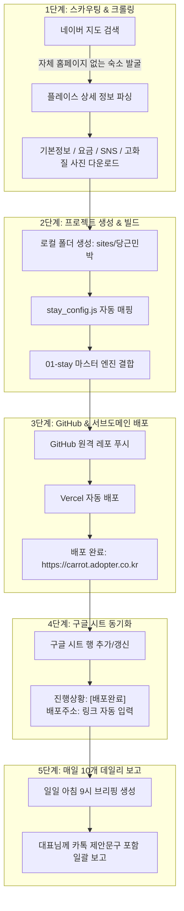

# 🚀 어댑터(Adopter) 무인 웹 에이전시 자동화 시스템 마스터 플랜

본 문서는 **네이버 지도 숙박업소 자동 발굴 ➔ 데이터/사진 크롤링 ➔ 마스터 템플릿(01-stay) 기반 웹사이트 빌드 ➔ 서브도메인(`*.adopter.co.kr`) 자동 배포 ➔ 구글 시트 동기화 ➔ 매일 10개 자동화 보고**로 이어지는 완전 무인 웹 에이전시 시스템의 전체 아키텍처 및 단계별 실행 계획서입니다.

---

## 📌 1. 비즈니스 핵심 모델 & 차별화 포인트

- **영업 방식**: "선제작 후제안 (Pre-build Pitching)"
- **타겟 고객**: 네이버 플레이스에 고품질 사진과 정보가 등록되어 있으나, 자체 단독 웹사이트가 없는 전국 감성 펜션, 풀빌라, 독채 숙소
- **제안 방식**: 사장님 숙소 사진과 요금표로 이미 완성된 프리미엄 서브도메인 사이트(`https://[숙소슬러그].adopter.co.kr`) 링크를 카톡/문자로 전달하여 즉각적 구매 욕구 자극
- **수익 모델**: 
  - 기본 제작비 (초기 20~30만 원)
  - 월 유지보수/서버/도메인 관리비 (월 1~2만 원)

---

## 🌐 2. 서브도메인 배포 아키텍처 (`*.adopter.co.kr`)

대표님의 기본 도메인인 `adopter.co.kr`을 활용하여 신규 제작 숙소마다 고유의 서브도메인을 자동 부여합니다.

### 1) 네이밍 룰 (Subdomain Convention)
- 영문 슬러그(Slug) 규칙: 영문 소문자 + 하이픈
- 예시:
  - 세화 당근민박 ➔ `https://carrot.adopter.co.kr` (또는 `danggeun.adopter.co.kr`)
  - 제주 희스테이 ➔ `https://heestay.adopter.co.kr` (또는 `jejuheestay.co.kr`)
  - 애월 온담 ➔ `https://ondam.adopter.co.kr`

### 2) 배포 연동 방식 (2가지 경로)
- **방식 A (Vercel Project 단위 서브도메인 연결 - 추천)**:
  - 숙소마다 독립된 GitHub 레포지토리(또는 단일 모노레포의 브랜치/디렉터리) 생성
  - Vercel에 프로젝트 연결 후 `Domains` 설정에서 `[slug].adopter.co.kr` 추가
  - DNS(`adopter.co.kr`)에서 `CNAME` 레코드(`cname.vercel-dns.com`) 1회 등록으로 자동 SSL 인증서(HTTPS) 발급
- **방식 B (와일드카드 서브도메인 멀티테넌트 라우터)**:
  - `*.adopter.co.kr`을 하나의 Vercel 앱으로 연결하고, 접속한 서브도메인 호스트명에 따라 해당 숙소의 `stay_config.js`를 동적으로 렌더링하는 SaaS 방식

---

## 🔄 3. 전체 자동화 파이프라인 (5단계 로드맵)

---

## 📊 4. 구글 시트 CRM 컬럼 구조 명세

| 열 | 컬럼명 | 자동화 처리 내용 |
| :---: | :--- | :--- |
| **A** | 카테고리 | `숙박업` 자동 분류 |
| **B** | 네이버링크 | 수집된 네이버 플레이스 모바일 URL |
| **C** | 업체명 | 네이버 플레이스 등록 상호명 |
| **D** | 폴더명 | 영문/한글 고유 폴더명 (예: `당근민박`, `carrot-stay`) |
| **E** | **배포주소** | **실제 라이브 서브도메인 링크 (`https://carrot.adopter.co.kr`)** |
| **F** | **진행상황** | `수집대기` ➔ `수집완료` ➔ `제작중` ➔ `배포완료` |
| **G** | 사진및db | `수집완료` (사진 N장 + stay_config.js 확보) |
| **H** | 연락처 | 0507 안심번호 또는 호스트 전화번호 |
| **I** | 주소 | 도로명 주소 |
| **J** | 평균금액 | 1박 기본 기준 요금 |
| **K~M** | SNS | 블로그, 인스타그램, 페이스북 링크 자동 분리 |
| **N** | 홈페이지 | 기존 독자 도메인 유무 (공란이면 미보유 타겟) |
| **O** | 기타 | 특이사항 (자쿠지 유무, 온수풀 유무 등) |

---

## 🛠️ 5. 단계별 구현 및 실행 일정

### [1단계] 당근민박(1호 타겟) 네이버 데이터 수집 & 템플릿 빌드 테스트
- 타겟: `https://m.place.naver.com/accommodation/1226740854/home`
- 네이버 데이터 파서 스크립트 작성 (`crawler/naver_stay_crawler.py`)
- 업체명, 주소, 전화번호, 사진, 객실 정보 크롤링 및 `stay_config.js` 생성
- 로컬 웹사이트 렌더링 검증

### [2단계] 서브도메인 배포 체계 연동
- 서브도메인(`carrot.adopter.co.kr` 또는 Vercel 프로젝트) 자동 배포 설정
- GitHub 저장소 생성 및 연동

### [3단계] 구글 시트 양방향 연동 봇 구현
- Python `gspread` 라이브러리를 통해 시트 읽기/쓰기 구현
- 수집 완료 시 시트 행 갱신, 배포 완료 시 URL 자동 업데이트

### [4단계] 매일 10개 배치 스케줄러 & 일일 보고 시스템 완성
- 매일 정해진 시간(예: 아침 9시)에 10개 발굴 ➔ 제작 ➔ 배포 ➔ 보고서 출력
